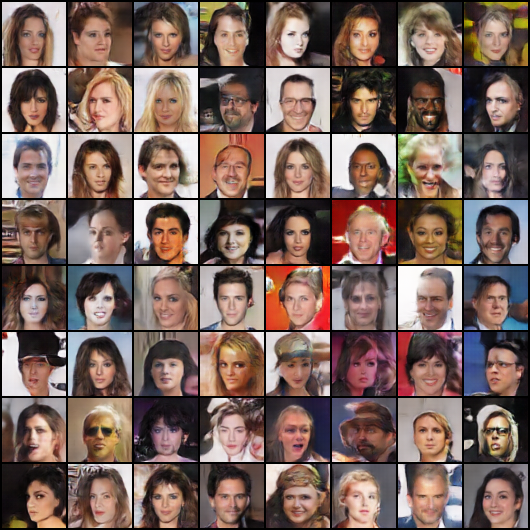
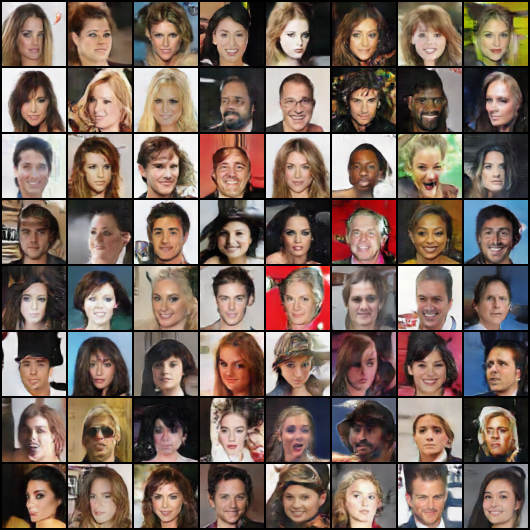
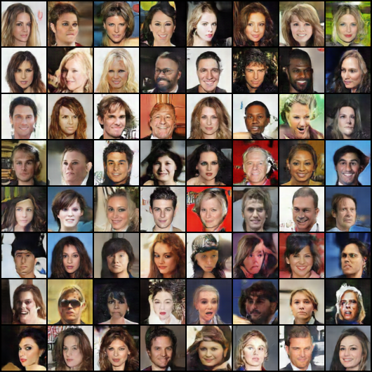
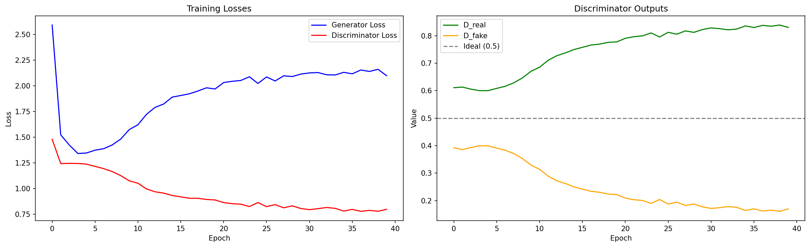

# GAN-CelebA

A deep learning project for learning and implementing a **Deep Convolutional Generative Adversarial Network (DCGAN)** to generate realistic human face images using the CelebA dataset.

---

## Table of Contents

- [Motivation](#motivation)
- [Dataset](#dataset)
- [Model Architecture](#model-architecture)
- [Training Details](#training-details)
- [Results](#results)
- [How to Run](#how-to-run)
- [Project Structure](#project-structure)
- [Dependencies](#dependencies)

---

## Motivation

Generative Adversarial Networks (GANs) are one of the most exciting and challenging areas of deep learning. This project was built as a hands-on learning exercise to understand:

- The theory and mechanics behind GANs
- How a Generator and Discriminator are trained adversarially
- The practical challenges of GAN training such as mode collapse, instability, and hyperparameter sensitivity
- How to implement and debug a DCGAN from scratch using PyTorch

The goal is not just to produce good results, but to deeply understand each component of the GAN training pipeline step by step.

---

## Dataset

**CelebA (Large-scale CelebFaces Attributes Dataset)**

- **Source:** [Kaggle - jessicali9530/celeba-dataset](https://www.kaggle.com/datasets/jessicali9530/celeba-dataset)
- **Size:** 202,599 celebrity face images
- **Original resolution:** 218 x 178 pixels
- **Preprocessed resolution:** 64 x 64 pixels (resized and center-cropped)
- **Normalization:** Pixel values normalized to the range `[-1, 1]` using mean and std of `0.5` per channel

### Preprocessing Pipeline

```python
transforms.Compose([
    transforms.Resize(64),
    transforms.CenterCrop(64),
    transforms.ToTensor(),
    transforms.Normalize((0.5, 0.5, 0.5), (0.5, 0.5, 0.5))
])
```

---

## Model Architecture

The architecture is based on the **DCGAN paper** by Radford et al. (2015), adapted for 64x64 RGB face generation.

### Generator

The Generator takes a random noise vector `z` of size 100 (latent dimension) and progressively upsamples it into a 64x64 RGB image using transposed convolutions.

| Layer | Output Shape | Details |
|---|---|---|
| Input (noise) | `[batch, 100, 1, 1]` | Random normal vector |
| ConvTranspose2d | `[batch, 1024, 4, 4]` | kernel=4, stride=1, padding=0 |
| ConvTranspose2d | `[batch, 512, 8, 8]` | kernel=4, stride=2, padding=1 |
| ConvTranspose2d | `[batch, 256, 16, 16]` | kernel=4, stride=2, padding=1 |
| ConvTranspose2d | `[batch, 128, 32, 32]` | kernel=4, stride=2, padding=1 |
| ConvTranspose2d | `[batch, 3, 64, 64]` | kernel=4, stride=2, padding=1 |
| Output | `[batch, 3, 64, 64]` | Tanh activation |

- **Hidden activations:** ReLU
- **Final activation:** Tanh (outputs values in `[-1, 1]`)
- **Normalization:** BatchNorm2d after every layer except the last
- **Total parameters:** ~13.7 million

### Discriminator

The Discriminator takes a 64x64 RGB image (real or fake) and outputs a single value indicating the probability of the image being real.

| Layer | Output Shape | Details |
|---|---|---|
| Input | `[batch, 3, 64, 64]` | Real or fake image |
| Conv2d | `[batch, 128, 32, 32]` | kernel=4, stride=2, padding=1 |
| Conv2d | `[batch, 256, 16, 16]` | kernel=4, stride=2, padding=1 |
| Conv2d | `[batch, 512, 8, 8]` | kernel=4, stride=2, padding=1 |
| Conv2d | `[batch, 1024, 4, 4]` | kernel=4, stride=2, padding=1 |
| Conv2d | `[batch, 1, 1, 1]` | kernel=4, stride=1, padding=0 |
| Output | `[batch, 1]` | Single probability score |

- **Hidden activations:** LeakyReLU (slope=0.2)
- **Normalization:** BatchNorm2d after every layer except the first
- **Total parameters:** ~11 million

---

## Training Details

| Hyperparameter | Value |
|---|---|
| Optimizer | Adam |
| Generator learning rate | 0.0002 |
| Discriminator learning rate | 0.0001 |
| Beta1 | 0.5 |
| Beta2 | 0.999 |
| Batch size | 128 |
| Epochs | 40 |
| Latent dimension | 100 |
| Loss function | BCEWithLogitsLoss |
| Real labels (smoothed) | 0.9 |
| Fake labels (smoothed) | 0.1 |

### Key Training Decisions

**Label Smoothing:** Instead of hard labels of `0` and `1`, we use `0.9` for real and `0.1` for fake. This prevents the Discriminator from becoming overconfident and helps stabilize training.

**Weight Initialization:** All Conv and ConvTranspose layers are initialized with a normal distribution (mean=0, std=0.02). BatchNorm layers are initialized with weight=1 and bias=0, following the DCGAN paper.

**`detach()` in Discriminator step:** When training the Discriminator on fake images, `fake_batch.detach()` is used to prevent gradients from flowing back into the Generator, ensuring each network is updated independently.

**Different learning rates:** The Discriminator uses a lower learning rate (`0.0001`) than the Generator (`0.0002`). In the initial training run the Discriminator dominated and overpowered the Generator. Slowing it down gives the Generator more time to learn before facing a strong critic.

**Balanced architecture:** The Discriminator was scaled up to ~11M parameters (from ~2.7M) to better match the Generator's ~13.7M parameters. A stronger Discriminator provides more meaningful and nuanced feedback to the Generator during training.

### Speed Optimizations

**Faster data loading:** The DataLoader uses `num_workers=4`, `pin_memory=True`, and `persistent_workers=True` to maximize CPU→GPU data transfer speed and avoid worker restart overhead between epochs.

**`torch.compile()`:** Both models are compiled using PyTorch 2.0's `torch.compile(mode='reduce-overhead')` which JIT-compiles the models into optimized machine code, providing a 10-30% speed boost on GPU with no changes to the model itself.

**Labels created once:** Real and fake label tensors are created once before the training loop rather than being recreated every batch, eliminating thousands of redundant tensor allocations.

### Reliability

**Model checkpointing:** Model weights, optimizer states, and training metrics are saved to `/kaggle/working/` every 5 epochs, allowing training to be resumed from any checkpoint if the session is interrupted.

**Generated image snapshots:** A fixed noise vector is used to generate and save 64 face images every 5 epochs, creating a visual record of Generator progress throughout training.

### Training Loop Overview

Each batch consists of two steps:

1. **Train the Discriminator:**
   - Feed real images → compute loss against label `0.9`
   - Feed fake images (detached) → compute loss against label `0.1`
   - Total loss = real loss + fake loss → update Discriminator weights

2. **Train the Generator:**
   - Feed the same fake images through the updated Discriminator
   - Compute loss against label `0.9` (Generator wants Discriminator to think fakes are real)
   - Update Generator weights

---

## Results

### Training Metrics

The following metrics were tracked per epoch across 40 epochs of training on Kaggle T4 GPU:

| Metric | Epoch 1 | Epoch 10 | Epoch 20 | Epoch 40 |
|---|---|---|---|---|
| `Loss_G` | 2.59 | 1.57 | 1.97 | 2.10 |
| `Loss_D` | 1.48 | 1.07 | 0.89 | 0.80 |
| `D_real` | 0.61 | 0.67 | 0.78 | 0.83 |
| `D_fake` | 0.39 | 0.33 | 0.22 | 0.17 |

The Generator learned quickly in the first 10 epochs, producing recognizable faces by epoch 5. After epoch 10 the Discriminator gradually gained the upper hand, which is a common challenge in DCGAN training. The best visual quality was observed around **epochs 15–20**.

### Generated Images — Epoch Progression

The same fixed noise vector was used every 5 epochs to track Generator improvement visually. Each grid shows 64 generated faces.

**Epoch 5** — Faces already recognizable with clear facial structure


**Epoch 10** — Sharper faces, more realistic skin tones, better diversity



**Epoch 20** — Peak quality, many faces could pass as real celebrity photos



**Epoch 40** — Quality plateaus, Discriminator dominance visible in slight artifacts



### Loss Curves and Discriminator Outputs



The left plot shows `Loss_G` dropping sharply in the first 5 epochs as the Generator learns quickly, then rising gradually as the Discriminator gets stronger. `Loss_D` decreases steadily throughout, confirming the Discriminator dominance trend. The right plot shows `D_real` and `D_fake` diverging away from the ideal `0.5` line — both networks learned, but the Discriminator pulled ahead after epoch 10.

### Key Observations

- **No mode collapse** — all 64 generated faces are distinct throughout training ✅
- **Strong diversity** — male/female, different ethnicities, ages, and hair styles represented ✅
- **Fast convergence** — recognizable faces appeared as early as epoch 5 ✅
- **Discriminator dominance** — `D_fake` dropped from `0.39` to `0.17` over 40 epochs, indicating the Discriminator gradually overpowered the Generator. This is a known challenge in DCGAN training and a direction for future improvement.

---

## How to Run

### On Kaggle (Recommended)

1. Go to [Kaggle](https://www.kaggle.com) and create a new notebook
2. Add the CelebA dataset:
   - Click **+ Add Input** in the right panel
   - Search for `jessicali9530/celeba-dataset` and add it
3. Enable GPU:
   - Right panel → **Session Options** → **Accelerator → GPU T4 x2**
4. Clone this repository in a notebook cell:
   ```bash
   !git clone https://github.com/vidasaeedzadeh/GAN-CelebA.git
   ```
5. Run the notebook cells in order

### Verify GPU is Available

```python
import torch
device = torch.device('cuda' if torch.cuda.is_available() else 'cpu')
print(device)  # Should print: cuda
```

### Dataset Path on Kaggle

```python
data_folder = '/kaggle/input/datasets/jessicali9530/celeba-dataset/img_align_celeba/img_align_celeba/'
```

---

## Dependencies

```
torch
torchvision
torchsummary
numpy
matplotlib
Pillow
pandas
```

Install with:
```bash
pip install torch torchvision torchsummary numpy matplotlib Pillow pandas
```

---

## References

- Radford, A., Metz, L., & Chintala, S. (2015). [Unsupervised Representation Learning with Deep Convolutional Generative Adversarial Networks](https://arxiv.org/abs/1511.06434)
- Liu, Z., Luo, P., Wang, X., & Tang, X. (2015). [Deep Learning Face Attributes in the Wild](https://arxiv.org/abs/1411.7766) (CelebA dataset)
- Goodfellow, I., et al. (2014). [Generative Adversarial Nets](https://arxiv.org/abs/1406.2661)
